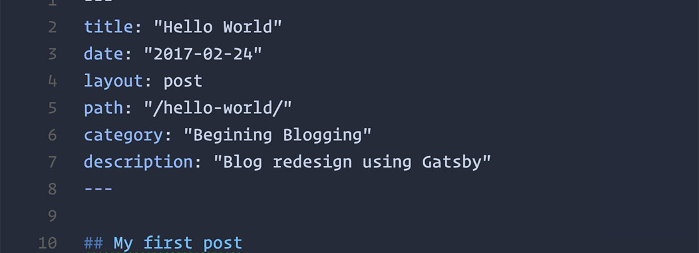

## Working with PostCSS

I've been using `SASS` for quite some time now as my go to CSS pre-processor. It felt very familiar from using vanilla CSS, or **Cascading Style Sheets** but gives you conveniances like:

* variables for colors, fonts, etc
* nesting!
* mixins

I recall on my first project that I was introduced to SASS, I was impressed on how quickly I adopted it and became a fan.

The only downfall I could think of is that it requires a task runner to convert the SASS code into regular CSS that the browser could understand. At the time I was introduced to SASS we were using `grunt` as our task runner which later we replaced with `gulp` and now `webpack` is all the rage.

This step was at first manual process having to run things like `gulp sass` to run the sass transpilation but you could also set watchers to run anytime gulp detected changes in any .sass files.

## So why PostCSS?

PostCSS has come along and become very popular. PostCSS is an engine for transforming CSS with Javascript. Since it using NodeJS, it claims to be **3-30 times faster** than the competition. SASS for example is built in Ruby and once you start adding gems can run a little bit slower. PostCSS is modular so at its core it is much smaller and you only add what you need.

Another big difference is that it can also do post processing like add prefixes to a finished stylesheet. PostCSS has a large plug-in base so you can choose plug-ins like future CSS support, prefixing to support older browsers, and SASS like features like nesting and variables.

## Getting Started

PostCSS requires Node so you can install it on a mac with this brew command from terminal.

```terminal
brew update
brew install node
```

If you're unfamiliar with brew, it is a package manager for macOS and you can learn more here.

[Homebrew -the missing package manager for macOS][homebrew]

[homebrew]: https://brew.sh/


 