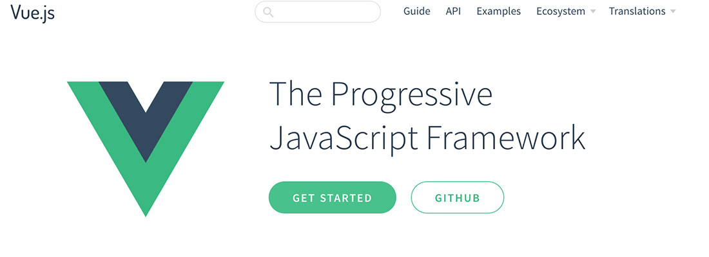

## Learning Javascript in 2017

Continuing on my goal to learn more Javascript in 2017, I decided to start my adventure with React.

Having completed a couple tutorials and was feeling pretty excited about about it, its ecosystem, and its popularity in the Javascript world.

One of my concerns is am I investing in the right Javascript framework?Mentors will tell you that you just need to pick one and go with it.

I was feeling a little fuzzy on my React training so launching this blog using React help solidy some of that knowledge.

## And then there was Vue

Jeffrey Way had released a free series on [Vue.js][vue] that had perked my interest. I feel that he is a great teacher and have been a subscriber to [Laracasts][laracasts] for a long time.

I was wanting a break from React and wanted to get a taste for how it would be to work with Vue so I gave it a go.

Right away I fell in love.

There is no complicated setup all you do is drop in one javascript tag and you are ready to go. No fancy setup required.

```js
<script src="https://unpkg.com/vue"></script>
```

Next you'll want to setup your template.

#### html

```html
<div id="app">
    {{ message }}
</div>
```

#### javascript

```javascript
var app = new Vue({
    el: '#app',
    data: {
        message: 'Hello World'
    }
})
```

Congrats you have just setup your first Vue app. We are telling Vue to connect to the id `app` and then we are passing in the data `message` using the moustache syntax `{{ message }}`.

Vue.js is simple to work with and just makes sense to me. It doesn't hurt that you have one of the best teacher's with Jeffrey Way.

I really recomend his free Vue.js 2 course entitled [Learn Vue 2: Step By Step][laracast-vue].

After completing the course I was so excited to learn more about Vue that I started reading a book named [Learning Vue.js 2][book] by Olga Filipova.

This book was listed as one the resources from the [Awesome Vue][awesome-vue] github repo that has tons of Vue related resources.

## Changing Teams

So now I have changed teams from React to Vue.

My mentor says that either one you chose it will help you further your Javascript learning so these are inline with my professional goals.

## Wrapping Up

I am enjoying the book so far and am excited to learn Vue deeper. I am typically a visual learner but it is refreshing going **old school** and reading an ebook. So far I have completed Chapter 2 and have learned a bunch so far. Some of the exercises are creating a Shopping List and a Pomodoro timer. I think you will enjoy learning and using Vue.js in your projects too.

[vue]: https://vuejs.org/
[laracasts]: https://laracasts.com/
[laracast-vue]: https://laracasts.com/series/learn-vue-2-step-by-step
[awesome-vue]: https://github.com/vuejs/awesome-vue
[book]: https://www.packtpub.com/web-development/learning-vuejs-2