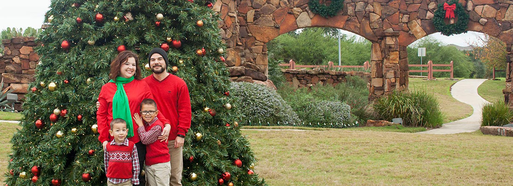

My name is Frank Pigeon Jr. I am a father of three boys, husband to my [beautiful wife][kayTwitter], and a front end web developer.

I was born in San Antonio, Texas and grew up in the tropical country of Panama.

I am a U.S. Army veteran and am still serving my country as a Dept. of Army Civilian.

I enjoy coding, photography, audio/video production, and all-things open-source.

I am the owner of a freelance business [Pigeontec][pigeontec] which is a single person Digital Agency.

[kayTwitter]: https://twitter.com/kay_pigeon
[pigeontec]: http://pigeontec.com